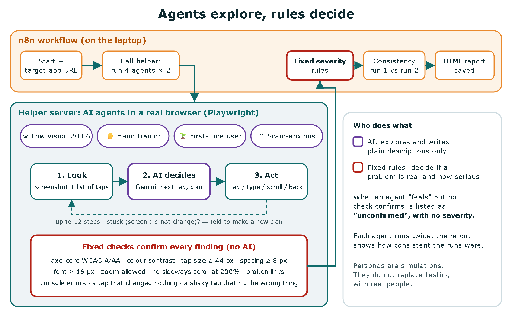
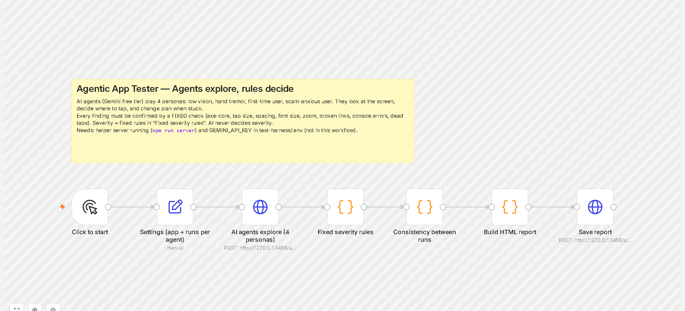
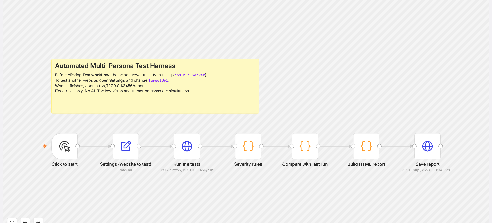

# Agentic App Tester

**Agents explore, rules decide.**

AI agents use a web app the way four different people might. Every problem they run into must be **confirmed by a fixed check** before it counts, and **fixed rules decide how serious it is**. Runs on a laptop with n8n, Playwright, axe-core and the Gemini free tier. It works on any web app that has a URL.

**Demo video:** [docs/demo/agents-demo.webm](docs/demo/agents-demo.webm). An agent with a simulated hand tremor uses a public app, its thinking shows as captions, and the fixed checks confirm what went wrong.
**Sample reports from real runs:** [sample-reports/](sample-reports/)



## The problem
Automated accessibility scanners only check the first screen they load. The screens behind taps, such as a result, a dialog or a second step, are never checked. Real usability testing with older or disabled people is the gold standard, but it is slow and rare. AI agents can explore deeper, but an AI's opinion is not evidence.

## The solution
| Who | Does what |
|---|---|
| **4 AI agents** (Gemini) | Each has a persona and a goal. At every step it gets a screenshot plus a numbered list of what can be tapped, **decides** the next action (tap, type, scroll, back, done, give up), and writes its plan. If the screen did not change for 2 steps, it is told it is stuck and must make a new plan. Max 12 steps. |
| **Fixed checks** (no AI) | Run on **every new screen the agents reach**: axe-core WCAG 2 A/AA (including contrast), tap size ≥ 44 px, spacing ≥ 8 px around small targets, text ≥ 16 px, zoom not blocked, no sideways scroll at 200% (low vision), broken same-site links, console errors, a tap on a button that changed nothing, and a shaky tap that landed on the wrong thing (tremor). |
| **Fixed rules in n8n** | Decide severity (serious / medium / minor), merge the same finding from several agents, and measure consistency between runs. |
| **AI again** | Writes one plain sentence per *confirmed* finding, from the persona's point of view. It never decides severity. |

When an agent reports a difficulty, for example "buttons too close", the matching fixed check is looked up on the same screen. If it confirms, the finding is marked **reported by the agent + confirmed**. If nothing confirms it, it goes to an **unconfirmed** list with no severity. That includes opinions like "confusing" that no check can prove.

### The personas (simulations, not real people)
| Persona | Simulation |
|---|---|
| Rosa, 78, low vision | page zoomed to 200% |
| Walter, 81, hand tremor | each tap lands up to 9 px away from the centre of the target |
| Grace, 70, first-time user | knows no technical words, follows only what the screen says |
| Harold, 74, scam-anxious | suspicious, looks for proof before trusting |

## n8n workflows


- `agent-workflow.json`: **Agentic App Tester** (Start → Settings → AI agents explore → Fixed severity rules → Consistency between runs → Build HTML report → Save report). `agent-workflow.papershield.json` and `agent-workflow.todomvc.json` are the same workflow pointed at the two apps.
- `workflow.json`: the original **fixed-rule test harness**, a crawler with two simulated personas and no AI.



No keys are in any workflow. The Gemini key is read from `.env` by the helper server, and `.env` is never committed.

## Results (real runs inside n8n 2.42.5 on this laptop, October 8, 2026)
Each agent ran **twice** on each app. Model: `gemini-3.1-flash-lite` (free tier). Max 12 steps per run.

| | PaperShield (my app) | TodoMVC (public demo app from the Playwright project) |
|---|---|---|
| Agent runs that reached their goal | **4 of 8**: tremor 2/2, first-time 2/2, low vision 0/2, scam-anxious 0/2 | **8 of 8** |
| Personas with the same outcome in both runs | 4 of 4 | 4 of 4 |
| Average overlap of confirmed findings between run 1 and run 2 | 75% (hand tremor: 0%; it found its only finding in 1 of 2 runs) | 99% |
| Confirmed findings (after merging duplicates) | **1** (medium): a shaky tap aimed at "Benefits form" landed on something else, in 1 of 2 runs | **33**: 9 serious (colour contrast), 24 medium (16 text under 16 px, 5 tap targets under 44 px, 3 small targets too close together) |
| Confirmed findings that an agent reported first | 1 | 3 |
| Agent reports that no fixed check confirmed (no severity) | 35 (mostly "confusing", "hard to read", "text cut off" at 200% zoom) | 1 |
| AI calls / time / tool errors | 78 / 11.7 min / 0 | 40 / 6 min / 0 |

Reports: [sample-reports/agents-papershield.html](sample-reports/agents-papershield.html) · [sample-reports/agents-todomvc.html](sample-reports/agents-todomvc.html) (open them after downloading; GitHub shows HTML as code).

**What it found in my own app, and what I fixed.** Earlier runs on PaperShield (kept in [sample-reports/history/](sample-reports/history/)) found real problems. Each one was confirmed by a fixed check, then fixed in the app, and the next run no longer showed it:
1. **A crash (serious):** tapping the big "Scan a document" button crashed the camera screen ("pages.map is not a function"). This bug had been in the app from the start. The hand-tremor agent found it when a shaky tap landed on that button.
2. The 🔊 "Read aloud" buttons gave no visible feedback ("a tap that changed nothing"). Now they show "Stop", or a message if the phone cannot read aloud.
3. The "Skip to content" link stayed 1×1 px, even with keyboard focus.
4. The sample-letter buttons were close together for a shaky tap. I added space. In the last run the tremor agent still missed "Benefits form" once (1 of 2 runs). **The exact cause is not found yet, so this one is not fixed.**

**What it found wrong in itself** (so the numbers above are clean): in the first run, 2 "errors" were caused by the tester, not the app. The screenshot option injected CSS that the app's security policy blocked, and the 200% zoom simulation ran before the page existed. Two checks were also too strict: a tap on an option that was already selected counted as "changed nothing", and a hidden skip link was measured as a tap target. All four were fixed in the tool before the final runs.

**Honest notes**
- Low vision and scam-anxious on PaperShield did not reach their goal in 12 steps. At 200% zoom, the 3 welcome screens need a lot of scrolling. This matches the agents' many "text cut off / hard to read" reports, but **no fixed check can prove "too long"**, so those stay unconfirmed. Next step: test a shorter first-run flow.
- Results depend on the model. With the earlier model (`gemini-3.5-flash-lite`), the scam-anxious agent reached its goal 2 of 2 times. That model then hit its **free daily limit of 500 requests**, and one run was cut short (kept in history). I switched models and re-ran everything, so the final numbers above all come from one model.
- The original fixed-rule harness (no AI), run inside n8n on the demo site with planted bugs: 6 pages, **33 findings (15 serious, 18 medium)**, 44 seconds.


## Run it yourself
```bash
npm install
npx playwright install chromium
echo GEMINI_API_KEY=your-free-key > .env      # https://aistudio.google.com/apikey
npm run server                                 # helper server on http://127.0.0.1:3456
# in a second window:
npx n8n@2.42.5 import:workflow --input=agent-workflow.json
npx n8n@2.42.5 execute --id=agenticTester01
# report: http://127.0.0.1:3456/agents/report
```
Change the app under test with `TARGET_URL=https://... node build-agent-workflow.js` and import again.
The original harness without AI: `node run-once.js https://any-site` or import `workflow.json`. The demo site with planted bugs is `npm run demo-site`.

## Limits (honest)
- The personas are **AI simulations**. They do not replace testing with real older adults or disabled people. Screen readers were not used.
- AI agents are not deterministic: the same agent can take a different path on a second run. That is why each agent runs twice and the report shows how consistent the runs were.
- Fixed checks only prove what they measure. "Confusing" or "scary" cannot be proven by a rule, so those stay unconfirmed.
- The free Gemini tier has daily limits (500 requests per model per day). The final runs took 12 minutes (PaperShield) and 6 minutes (TodoMVC); on a busy, rate-limited day the same work took over an hour.

## What I would do in production
Real user sessions to calibrate the personas; more runs per agent with a confidence measure; screen-reader agents (VoiceOver / TalkBack); CI on every pull request with a "new serious findings" gate; a paid, faster model with logging and cost limits.

## My role
I (Mai Hakim) designed this tool and decided the personas, the rule that every finding must be confirmed by a fixed check, the severity rules and the test plan. **Claude (an AI assistant) wrote the code.**
Inspired by a capstone idea; this is my own independent build. In the team capstone, n8n was used only for testing.
